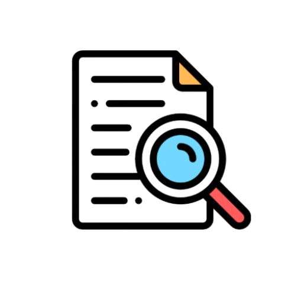
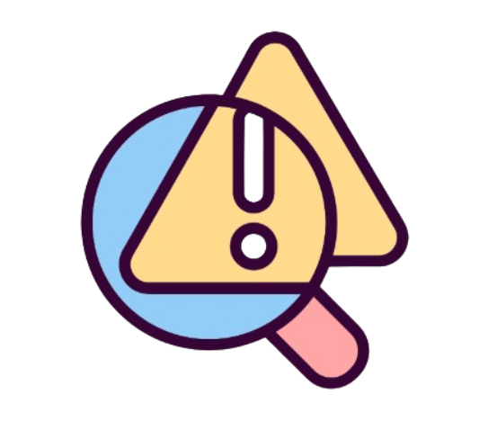
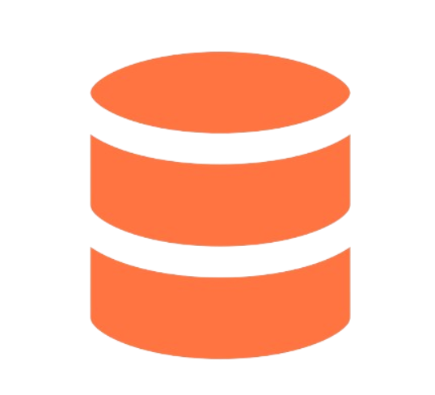
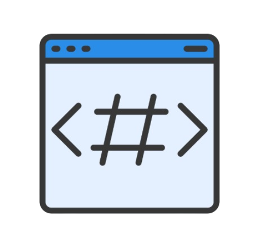

  

<h1 align="center">Collabflo</h1>
<h3 align="center"><em>A mobile application that connects businesses and creators for seamless, meaningful collaborations.</em></h3>

 

---

# OVERVIEW 

 

The 'Collabflo' is a mobile application where versatile businesses and creators can create, connect and collaborate for limitless opportunities. Users can create respective profiles as "business" or a "creator", collab/uncollab each other, chat seamlessly and many more. This platform acts as a healthy ecosystem where businesses and creators collaborate to create something big.

 

---

# OBJECTIVES 

 

### 🎯 **Primary Goal**
Build a scalable Flutter platform connecting creators and businesses for seamless collaboration.

 

| 🧑‍💻 **User Management** | 🤝 **Collaboration Engine** | ⚡ **Performance** |
| :--- | :--- | :--- |
| Implement dual-role system | One-tap collaboration | Cross-platform compatibility |
| Enable comprehensive profiles | Real-time messaging | 60 FPS performance |
| Secure authentication | Voice communication | 10K+ concurrent users |
| Profile verification system | Status tracking | <2-second loading |
| Privacy controls | Project management | <1% crash rate |

| 🔒 **Security & Reliability** | 📈 **Growth & Metrics** | 🚀 **Future Expansion** |
| :--- | :--- | :--- |
| Row-Level Security (RLS) | 10K users in Year 1 | AI matchmaking system |
| 99.5% uptime guarantee | 40% Week 1 retention | Payment integration |
| End-to-end encryption | 5K+ collaborations | Community features |
| Data backup systems | 90% onboarding success | Analytics dashboard |
| Regular security audits | 4.5/5 satisfaction rating | API ecosystem |

 

---

# PROBLEM STATEMENTS 

 

### 🔍 **The Core Problem**

**Creator-Business Collaboration is Broken** - Fragmented across 7+ platforms, inefficient communication, and no standardized workflow causing **40% wasted time** and **missed opportunities**.

 

### 📊 **MARKET & INDUSTRY CHALLENGES**

| **Area** | **Current Pain Points** | **Business Impact** |
| :--- | :--- | :--- |
| **Discovery** | No unified platform, inconsistent portfolios | 15+ hours weekly wasted on search |
| **Communication** | Scattered across 5+ apps, lost context | 30% project delays from miscommunication |
| **Workflow** | No standard process, manual tracking | 25% admin overhead for simple projects |
| **Trust & Verification** | Fake metrics, no performance history | 40% of collaborations underperform |
| **Monetization** | Complex invoicing, delayed payments | Average 45-day payment cycles |

 

### 👥 **USER-SPECIFIC PROBLEMS**

 

#### **👨‍💼 BUSINESS USERS**

| **Category** | **Specific Problem** | **Consequence** |
| :--- | :--- | :--- |
| **Discovery** | Can't filter creators by niche + budget | Settle for mismatched talent |
| **Vetting** | No standardized performance metrics | High-risk hiring decisions |
| **Coordination** | Multiple point-of-contacts for one project | Scope creep and misalignment |
| **Payment** | No escrow or milestone protection | 15% project budget lost to disputes |
| **Scaling** | Can't manage multiple creators efficiently | Manual spreadsheet tracking |

 

#### **🎨 CREATOR USERS**

| **Category** | **Specific Problem** | **Consequence** |
| :--- | :--- | :--- |
| **Visibility** | Buried under algorithm changes | Inconsistent opportunity flow |
| **Negotiation** | No rate transparency or benchmarks | 35% undercharging for services |
| **Portfolio** | Static showcases, no interactive demos | Reduced conversion from views to hires |
| **Admin** | Manual invoicing and contract management | 20% time spent on non-creative work |
| **Growth** | No clear path to premium rates/clients | Stagnant career progression |

 

### ⚙️ **TECHNICAL & PLATFORM CHALLENGES**

| **Layer** | **Current Gap** | **User Impact** |
| :--- | :--- | :--- |
| **Real-time Sync** | No live collaboration status updates | Missed opportunities and coordination fails |
| **Media Management** | No optimized upload/compression | 60% slower portfolio loading |
| **Cross-platform** | Platform-specific limitations | Android/iOS/Web experience inconsistencies |
| **Data Security** | Sensitive project details in unsecured chats | IP theft and confidentiality breaches |
| **Scalability** | Existing solutions crash at 1,000+ users | Poor experience during peak usage |

 

### 📈 **ECONOMIC & SCALABILITY PROBLEMS**

| **Stage** | **Barrier** | **Result** |
| :--- | :--- | :--- |
| **Entry** | High learning curve for non-tech users | 65% abandonment during onboarding |
| **Engagement** | No intelligent matching or suggestions | Declining activity after initial signup |
| **Retention** | No value beyond initial connection | 60% churn within 90 days |
| **Monetization** | No integrated payment/tracking | Users revert to external tools |
| **Growth** | No viral or network effects | Linear, costly user acquisition |

 

### 🔮 **FUTURE-READINESS GAPS**

| **Aspect** | **Missing Capability** | **Strategic Risk** |
| :--- | :--- | :--- |
| **AI Integration** | No predictive matching or automation | Becoming obsolete as competitors add AI |
| **Mobile-First** | Desktop-heavy existing solutions | Missing 70% of creator workflow (mobile) |
| **API Ecosystem** | Closed systems, no integrations | Can't connect to users' existing toolstack |
| **Analytics** | Basic metrics, no actionable insights | Users can't optimize their performance |
| **Globalization** | Single currency/language support | Missing 85% of addressable market |

 

### 💡 **THE OPPORTUNITY STATEMENT**

 

**CollabFlo solves these interconnected problems by providing:**

✅ **Unified Discovery** - Structured profiles with verified metrics  
✅ **Streamlined Workflow** - End-to-end collaboration management  
✅ **Secure Communication** - Encrypted chat with project context  
✅ **Integrated Payments** - Escrow and milestone protection  
✅ **Scalable Architecture** - Built for 100K+ users from Day 1  

 

**Impact Metrics Targeted:**

- Reduce discovery time from 15 to 2 hours  
- Increase successful collaborations by 300%  
- Decrease payment disputes by 90%  
- Cut admin overhead from 25% to 5%  
- Improve creator earnings transparency by 70%  

 

---

# TECHNOLOGY STACK 

 

|  Flutter |  Supabase |  Android Studio |
| :---: | :---: | :---: |

 

---

# MOBILE INTERFACES 

 

| <h3>Signin Screen</h3> | <h3>Signup Screen</h3> |
| :---: | :---: |
|  |  |

 

| <h3>Home Screen</h3> | <h3>Chat Screen</h3> |
| :---: | :---: |
|  |  |

 

| <h3>Post Screen</h3> | <h3>Discover Screen</h3> |
| :---: | :---: |
|  |  |

 

| <h3>Profile Screen</h3> |
| :---: |
|  |

 

---

## KEY FUNCTIONS 

 

### 📱 Sign In Screen
- Existing user login with email and password
- "Forgot Password" option for account recovery
- Remember me functionality for quick access
- Redirect to Sign Up screen for new users

### 📝 Sign Up Screen
- New user registration with email and password
- Role selection: Business or Creator account type
- Username creation and profile photo upload
- Automatic access to Home screen after successful registration

### 🏠 Home Screen
- Real-time display of posts from all community members
- Light/Dark theme toggle for personalized experience
- Like, comment, and share functionality on posts
- Quick logout access from app bar
- Bottom navigation bar for easy screen switching

### 💬 Chat Screen
- Real-time text messaging with collaborators
- Voice message recording and playback feature
- Edit and delete sent messages seamlessly
- Share images and collaboration files
- Typing indicators and read receipts

### 📤 Post Screen
- Create posts with text, images, or videos
- Share updates, achievements, and opportunities
- Tag relevant businesses or creators in posts
- Boost visibility for collaboration opportunities

### 🔍 Discover Screen
- Search for creators and businesses by name or niche
- Filter by role, industry, skills, or location
- Separate tabs for "Collaboratings" (sent requests)
- Separate tabs for "Collaborators" (accepted connections)
- Send collaboration requests directly from search results

### 👤 Profile Screen
- Edit and customize profile information
- Add portfolio links, skills, and work samples
- View collaboration history and reviews
- Earn "Flo Verification Badge" by meeting quality criteria
- Track profile completeness score

### 📢 Campaign Screen
- Businesses can create collaboration campaigns
- Define campaign goals, budget, and timeline
- Creators can browse and apply to campaigns
- Track campaign applications and responses

 

---

# FUTUTRE POTENTIAL 

 

### 💰 **PAYMENT & FINANCIAL SYSTEMS**

| Feature | Description | Benefit |
| :--- | :--- | :--- |
| **Escrow Protection** | Payment held securely until work is completed and approved by both parties | Zero financial risk for businesses and creators |
| **Milestone-Based Releases** | Payments released progressively as project milestones are achieved | Steady cash flow for creators, controlled spending for businesses |
| **Multiple Payment Options** | Support for credit cards, UPI, PayPal, bank transfers, and crypto | Flexible payment methods for global users |
| **Automated Invoicing** | Generate and send professional invoices automatically after payment | Hassle-free accounting and tax compliance |
| **Dispute Resolution** | Built-in mediation system for payment conflicts with third-party arbitrators | Fair settlements without legal hassles |

 

### 🤝 **DEAL & CONTRACT MANAGEMENT**

| Feature | Description | Benefit |
| :--- | :--- | :--- |
| **Digital Agreements** | Create legally binding contracts within the app with e-signature | Legal protection for both parties |
| **Role-Based Assignments** | Assign specific roles (Designer, Writer, Editor, Developer) for each collaboration | Clear responsibility definition |
| **Customizable Terms** | Set deal terms, deadlines, deliverables, and conditions | Flexible agreements for any project type |
| **Auto-Release Conditions** | Payment automatically released when work is marked complete and approved | No manual payment follow-ups |
| **Work Timeline Tracking** | Monitor project progress against agreed deadlines with alerts | On-time project delivery |

 

### 🔒 **PAYMENT WORKFLOW PROCESS**

| Step | Action | Status |
| :---: | :--- | :---: |
| **Step 01** | Business and creator agree on terms and create a digital deal | 🟡 Agreement Pending |
| **Step 02** | Both parties sign the contract digitally | 🟢 Deal Active |
| **Step 03** | Business deposits full amount into CollabFlo escrow | 💰 Funds Secured |
| **Step 04** | Creator completes work and submits for review | 📤 Under Review |
| **Step 05** | Business reviews and approves completed work | ✅ Work Approved |
| **Step 06** | Payment automatically released to creator's account | 💵 Payment Completed |
| **Step 07** | Both parties rate and review collaboration experience | ⭐ Collaboration Closed |

 

### 🎯 **ROLE-BASED WORK LINKING**

| Role Category | Specific Roles | Matching Criteria | Work Type |
| :---: | :--- | :--- | :--- |
| **Creative** | Graphic Designer, Video Editor, Animator, Photographer | Portfolio, Style, Experience | Visual content creation |
| **Content** | Content Writer, Copywriter, Scriptwriter, Blogger | Writing samples, Niche expertise | Written content creation |
| **Digital** | Social Media Manager, SEO Expert, Digital Marketer | Campaign history, Results | Marketing & growth |
| **Technical** | Web Developer, App Developer, UI/UX Designer | Technical skills, Projects | Development & design |
| **Influencer** | YouTuber, Instagrammer, TikTok Creator, Blogger | Followers, Engagement rate | Brand promotions |

 

### 📊 **CAMPAIGN MANAGEMENT**

| Feature | Business Side | Creator Side | Outcome |
| :---: | :--- | :--- | :--- |
| **Campaign Creation** | Define goals, budget, timeline, requirements | Browse available campaigns | Clear opportunity posting |
| **Application Process** | Receive and review applications | Apply with portfolio and proposal | Structured selection |
| **Shortlisting** | Save and compare multiple creators | Track application status | Efficient hiring |
| **Budget Tracking** | Real-time budget monitoring | View offered compensation | Financial transparency |
| **Performance Analytics** | Track campaign ROI and metrics | Build success portfolio | Data-driven improvements |

 

### 🌐 **PLATFORM EXPANSION**

| Area | Features | Impact |
| :---: | :--- | :--- |
| **Geographic** | Multi-currency, multiple languages, regional compliance | Global user base expansion |
| **Technical** | AI matchmaking, smart recommendations, predictive analytics | Better collaboration matches |
| **Community** | Forums, events, webinars, mentorship programs | Stronger ecosystem bonding |
| **Verification** | Tiered badges, skill endorsements, trust scores | Authentic professional network |
| **Integration** | API access, third-party tools, portfolio imports | Seamless workflow integration |

 

### ✅ **BENEFITS SUMMARY**

| **For Businesses** | **For Creators** |
| :--- | :--- |
| No upfront payment risk - funds in escrow | Guaranteed payment upon work completion |
| Quality assurance before releasing payment | Professional deal structure and terms |
| Legal protection through digital contracts | Portfolio building with successful projects |
| Access to verified and rated talent | Fair market rates and transparent deals |
| Structured campaign management | Consistent work opportunities |
| Transparent collaboration tracking | Skill endorsements and verification badges |
| Dispute resolution when needed | Growth through ratings and reviews |

 

---

## FINAL NOTE

Thanks for reading! If you like this project please ⭐ the repo and feel free to open issues or PRs. Suggestions are always welcome!
