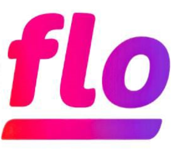

# Collabflo
## *A mobile application that connects businesses and creators for seamless, meaningful collaborations.*
  

# OVERVIEW 

The 'Collabflo' is a mobile application where versatile businesses and creators can create, connect and collaborate for limitless opportunities. Users can create respective profiles as "business" or a "creator",collab/uncollab each other, chat seamlessly and many more. This platform acts as a healthy ecosystem where businesses and creators collaborate to create something big.
  

# OBJECTIVES 

## 🎯 Primary Goal
Build a scalable Flutter platform connecting creators and businesses for seamless collaboration.

  
<table>
<tr>
<td width="33%" valign="top" align="left">

### 🧑‍💻 **User Management**
- Implement dual-role system
- Enable comprehensive profiles
- Secure authentication
- Profile verification system
- Privacy controls

</td>
<td width="33%" valign="top" align="left">
</td>

### 🤝 **Collaboration Engine**
- One-tap collaboration
- Real-time messaging
- Voice communication
- Status tracking
- Project management

</td>
<td width="33%" valign="top" align="left">

### ⚡ **Performance**
- Cross-platform compatibility
- 60 FPS performance
- 10K+ concurrent users
- <2-second loading
- <1% crash rate

</td>
</tr>
<tr>
<td width="33%" valign="top" align="left">

### 🔒 **Security & Reliability**
- Row-Level Security (RLS)
- 99.5% uptime guarantee
- End-to-end encryption
- Data backup systems
- Regular security audits

</td>
<td width="33%" valign="top" align="left">

### 📈 **Growth & Metrics**
- 10K users in Year 1
- 40% Week 1 retention
- 5K+ collaborations
- 90% onboarding success
- 4.5/5 satisfaction rating

</td>
<td width="33%" valign="top" align="left">

### 🚀 **Future Expansion**
- AI matchmaking system
- Payment integration
- Community features
- Analytics dashboard
- API ecosystem

</td>
</tr>
</table>

  

# PROBLEM STATEMENTS 

## 🔍 **The Core Problem**

**Creator-Business Collaboration is Broken** - Fragmented across 7+ platforms, inefficient communication, and no standardized workflow causing **40% wasted time** and **missed opportunities**.

---
  
## 📊 **MARKET & INDUSTRY CHALLENGES**

| **Area**               | **Current Pain Points**                     | **Business Impact**                        |
|-------------------------|---------------------------------------------|--------------------------------------------|
| **Discovery**           | No unified platform, inconsistent portfolios | 15+ hours weekly wasted on search          |
| **Communication**       | Scattered across 5+ apps, lost context      | 30% project delays from miscommunication   |
| **Workflow**            | No standard process, manual tracking        | 25% admin overhead for simple projects     |
| **Trust & Verification**| Fake metrics, no performance history        | 40% of collaborations underperform         |
| **Monetization**        | Complex invoicing, delayed payments         | Average 45-day payment cycles              |

---

## 👥 **USER-SPECIFIC PROBLEMS**

### **👨‍💼 BUSINESS USERS**
| **Category**         | **Specific Problem**                         | **Consequence**                            |
|----------------------|---------------------------------------------|--------------------------------------------|
| **Discovery**        | Can't filter creators by niche + budget     | Settle for mismatched talent               |
| **Vetting**          | No standardized performance metrics         | High-risk hiring decisions                 |
| **Coordination**     | Multiple point-of-contacts for one project  | Scope creep and misalignment               |
| **Payment**          | No escrow or milestone protection           | 15% project budget lost to disputes        |
| **Scaling**          | Can't manage multiple creators efficiently  | Manual spreadsheet tracking                |

### **🎨 CREATOR USERS**

| **Category**         | **Specific Problem**                         | **Consequence**                            |
|----------------------|---------------------------------------------|--------------------------------------------|
| **Visibility**       | Buried under algorithm changes              | Inconsistent opportunity flow              |
| **Negotiation**      | No rate transparency or benchmarks          | 35% undercharging for services             |
| **Portfolio**        | Static showcases, no interactive demos      | Reduced conversion from views to hires     |
| **Admin**            | Manual invoicing and contract management    | 20% time spent on non-creative work        |
| **Growth**           | No clear path to premium rates/clients      | Stagnant career progression                |

---

## ⚙️ **TECHNICAL & PLATFORM CHALLENGES**

| **Layer**            | **Current Gap**                              | **User Impact**                            |
|----------------------|---------------------------------------------|--------------------------------------------|
| **Real-time Sync**   | No live collaboration status updates        | Missed opportunities and coordination fails|
| **Media Management** | No optimized upload/compression             | 60% slower portfolio loading               |
| **Cross-platform**   | Platform-specific limitations               | Android/iOS/Web experience inconsistencies|
| **Data Security**    | Sensitive project details in unsecured chats| IP theft and confidentiality breaches      |
| **Scalability**      | Existing solutions crash at 1,000+ users    | Poor experience during peak usage          |

---

## 📈 **ECONOMIC & SCALABILITY PROBLEMS**

| **Stage**            | **Barrier**                                  | **Result**                                 |
|----------------------|---------------------------------------------|--------------------------------------------|
| **Entry**            | High learning curve for non-tech users      | 65% abandonment during onboarding          |
| **Engagement**       | No intelligent matching or suggestions      | Declining activity after initial signup    |
| **Retention**        | No value beyond initial connection          | 60% churn within 90 days                   |
| **Monetization**     | No integrated payment/tracking              | Users revert to external tools             |
| **Growth**           | No viral or network effects                 | Linear, costly user acquisition            |
,/div>
---

## 🔮 **FUTURE-READINESS GAPS**

| **Aspect**           | **Missing Capability**                       | **Strategic Risk**                         |
|----------------------|---------------------------------------------|--------------------------------------------|
| **AI Integration**   | No predictive matching or automation        | Becoming obsolete as competitors add AI    |
| **Mobile-First**     | Desktop-heavy existing solutions            | Missing 70% of creator workflow (mobile)   |
| **API Ecosystem**    | Closed systems, no integrations             | Can't connect to users' existing toolstack |
| **Analytics**        | Basic metrics, no actionable insights       | Users can't optimize their performance     |
| **Globalization**    | Single currency/language support            | Missing 85% of addressable market          |

---

## 💡 **THE OPPORTUNITY STATEMENT**

  
**CollabFlo solves these interconnected problems by providing:** 
✅ **Unified Discovery** - Structured profiles with verified metrics 
✅ **Streamlined Workflow** - End-to-end collaboration management 
✅ **Secure Communication** - Encrypted chat with project context 
✅ **Integrated Payments** - Escrow and milestone protection 
✅ **Scalable Architecture** - Built for 100K+ users from Day 1 

**Impact Metrics Targeted:** 
• Reduce discovery time from 15 to 2 hours 
• Increase successful collaborations by 300% 
• Decrease payment disputes by 90% 
• Cut admin overhead from 25% to 5% 
• Improve creator earnings transparency by 70% 

  

# TECHNOLOGY STACK 
 

  
<table> 
<tr> 
  <td> •  Flutter </td>
  <td> •  Supabase </td> 
  <td> •  Android Studio </td>
</tr> 
</table>

  

# MOBILE INTERFACES 

<table> 
  <tr valign="top">
  <td style ("border: none; text-align: left;">
  <h3>Signin screen</h3>
     
  
    </td> 
    
  <td style ("border: none; text-align: left;">
  <h3>Signup screen</h3>
     
  
    </td>
  </tr>
    
  <tr valign="top">
  <td style ("border: none; text-align: left;">
  <h3>Home screen</h3>
     
  
    </td> 
    
  <td style ("border: none; text-align: left;">
  <h3>Chat screen</h3>
     
  
    </td>
  </tr>
    
  <tr valign="top">
  <td style ("border: none; text-align: left;">
  <h3>Post screen</h3>
     
  
    </td> 
    
  <td style ("border: none; text-align: left;">
  <h3>Discover screen</h3>
     
  
    </td>
  </tr>

  <td style ("border: none; text-align: left;">
  <h3>Profile screen</h3>
     
  
    </td>
  </tr>
  
</table>
  

# KEY FUNCTIONS 
 

<h3> Registration screen </h3>
   
<ul> 
  <li> New user account registration. </li>
  <li> Old user account re-login. </li>
  <li> User account deletion (if-wanted). </li> 
</ul> 

<h3> Login screen </h3>
   
<ul> 
  <li> User account login (exact input of login credentials). </li>
  <li> New user registration and re-login. </li>
  <li> Access to main "Home page" of the application. </li> 
</ul> 

<h3>Home screen</h3>
   
<ul> 
  <li> User profile display. </li>
  <li> Display of the '3' main buttons of the application. </li>
  <li> User logout access. </li> 
</ul> 

<h3>Location tracking screen</h3>
   
<ul> 
  <li> User current location data analytics display </li>
  <li> Real-time location check against pre-defined geofence boundary with proper fingerprint authentication in order to detect an user is currently 'inside' or 'outside' the boundary. </li>
  <li> Based on final result displayed on screen, quick notification triggering happens with the result being saved in 'firebase' backend database. </li>
  <li> Until the screen is active the real-time location tracking goes on with updated analytics data. </li>
  <li> Until and unless the screen gets inactive, continious real-time location data fetching goes on to the 'firebase' backend database. </li>
</ul> 

<h3>Custom geofence screen</h3>
   
<ul> 
  <li> Any user's real-time location check against pre-defined geofence boundary only with availability of 'latitude' and 'longitude' data. </li>
  <li> User real-time path trajectory track on OSM display with analytics. </li>
  <li> Real-time multiple user's location sharing and display on map (with user consent). </li> 
  <li> Access to versatile map tiles like satellite view, street view, etc. </li>
</ul> 

<h3>Map screen</h3>
   
<ul> 
  <li> OpenStreetMap display with location navigation. </li>
  <li> Capture coordinate ability by clicking on any location of map. </li>
  <li> Database within application for storing, copyieng and deletion of coordinates being captured. </li>
  <li> Access to versatile map tiles like satellite view, street view, etc. </li>
</ul> 

  

# FUTURE POTENTIAL 
 

• Robust geofence setup: The system can inject any geofence boundary into the application. This opens the door for advanced use cases such as region-based workflows, restricted area based detection and customizable location rules. It makes the project highly flexible and adaptable to real-world scenarios.
&nbsp;&nbsp;

• Consent based multiple user tracking: With only after proper user consent, a single user can track the real-time locations of multiple users. This enables coordinated movement, team management and safety monitoring while ensuring privacyand user control remain a priority.
    

  
  <u>FINAL NOTE</u> 

  
  
 Thanks for reading! If you like this project please ⭐ the repo and feel to open issues or PRs. Suggestions are always welcome! 

