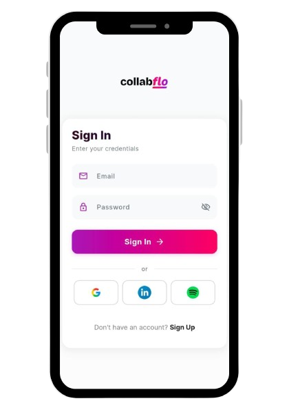
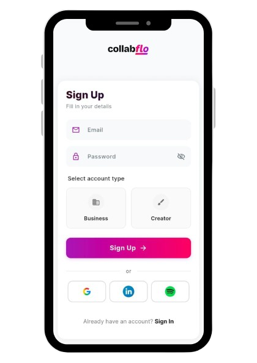
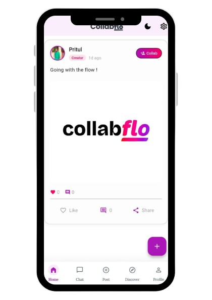
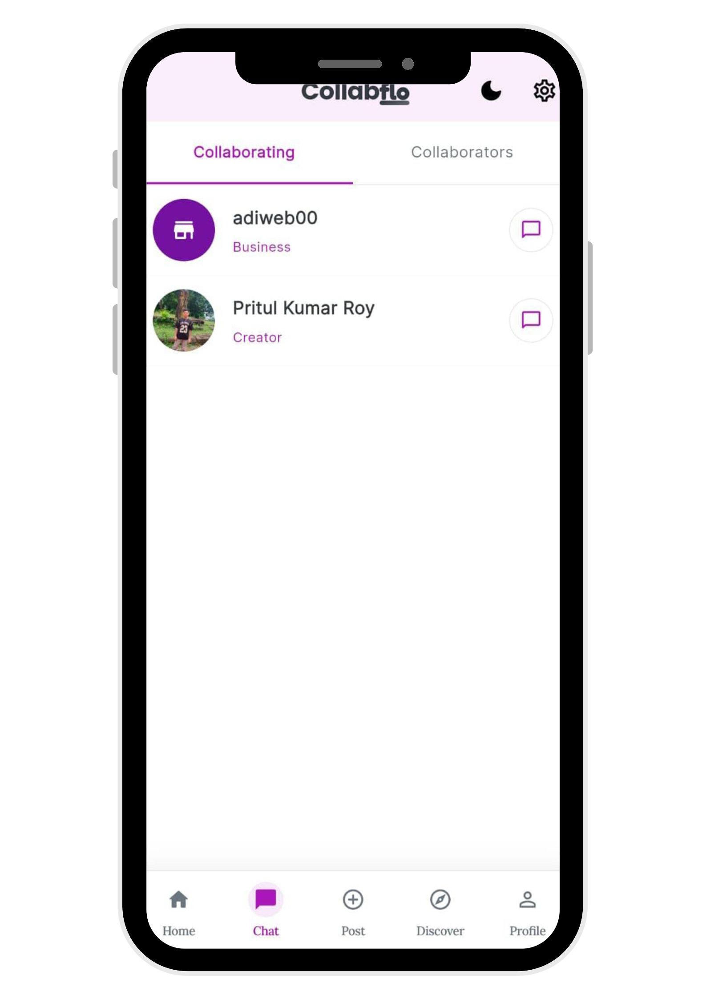
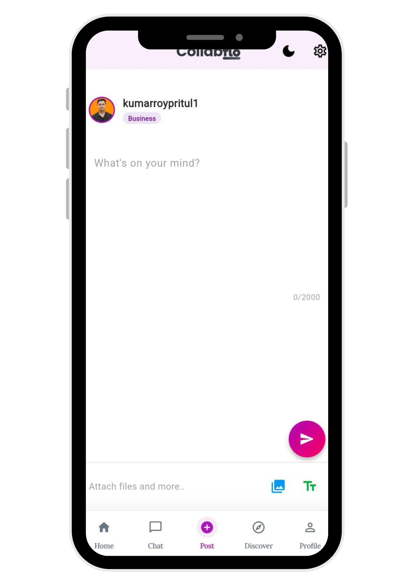
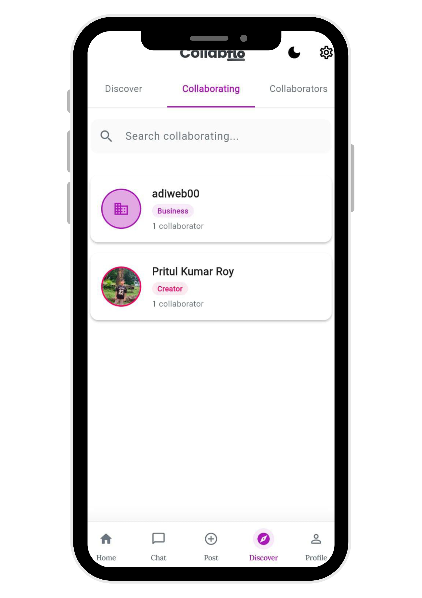
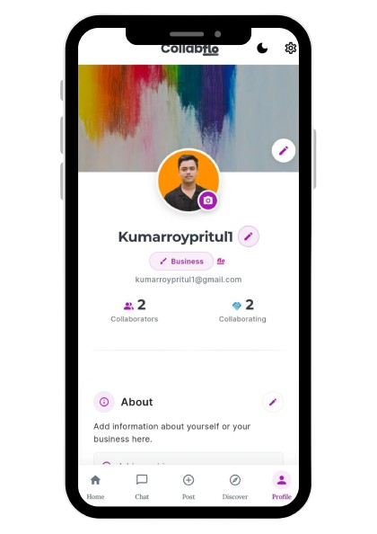

# Collabflo
## *A mobile application that connects businesses and creators for seamless, meaningful collaborations.*
  

# OVERVIEW 

The 'Collabflo' is a mobile application where versatile businesses and creators can create, connect and collaborate for limitless opportunities. Users can create respective profiles as "business" or a "creator",collab/uncollab each other, chat seamlessly and many more. This platform acts as a healthy ecosystem where businesses and creators collaborate to create something big.
  

# OBJECTIVES 

## 🎯 Primary Goal
Build a scalable Flutter platform connecting creators and businesses for seamless collaboration.

  
<table>
<tr>
<td width="33%" valign="top">

### 🧑‍💻 **User Management**
- Implement dual-role system
- Enable comprehensive profiles
- Secure authentication
- Profile verification system
- Privacy controls

 
</td>
<td width="33%" valign="top">

### 🤝 **Collaboration Engine**
- One-tap collaboration
- Real-time messaging
- Voice communication
- Status tracking
- Project management

 
</td>
<td width="33%" valign="top">

### ⚡ **Performance**
- Cross-platform compatibility
- 60 FPS performance
- 10K+ concurrent users
- <2-second loading
- <1% crash rate

</td>
</tr>
<tr>
<td width="33%" valign="top">

### 🔒 **Security & Reliability**
- Row-Level Security (RLS)
- 99.5% uptime guarantee
- End-to-end encryption
- Data backup systems
- Regular security audits

 
</td>
<td width="33%" valign="top">

### 📈 **Growth & Metrics**
- 10K users in Year 1
- 40% Week 1 retention
- 5K+ collaborations
- 90% onboarding success
- 4.5/5 satisfaction rating

 
</td>
<td width="33%" valign="top">

### 🚀 **Future Expansion**
- AI matchmaking system
- Payment integration
- Community features
- Analytics dashboard
- API ecosystem

</td>
</tr>
</table>

  

# PROBLEM STATEMENTS 
 
  
## 🔍 **The Core Problem**

**Creator-Business Collaboration is Broken** - Fragmented across 7+ platforms, inefficient communication, and no standardized workflow causing **40% wasted time** and **missed opportunities**.
  

## 📊 **MARKET & INDUSTRY CHALLENGES**

| **Area**               | **Current Pain Points**                     | **Business Impact**                        |
|-------------------------|---------------------------------------------|--------------------------------------------|
| **Discovery**           | No unified platform, inconsistent portfolios | 15+ hours weekly wasted on search          |
| **Communication**       | Scattered across 5+ apps, lost context      | 30% project delays from miscommunication   |
| **Workflow**            | No standard process, manual tracking        | 25% admin overhead for simple projects     |
| **Trust & Verification**| Fake metrics, no performance history        | 40% of collaborations underperform         |
| **Monetization**        | Complex invoicing, delayed payments         | Average 45-day payment cycles              |

 

## 👥 **USER-SPECIFIC PROBLEMS**
 

### **👨‍💼 BUSINESS USERS**

  
| **Category**         | **Specific Problem**                         | **Consequence**                            |
|----------------------|---------------------------------------------|--------------------------------------------|
| **Discovery**        | Can't filter creators by niche + budget     | Settle for mismatched talent               |
| **Vetting**          | No standardized performance metrics         | High-risk hiring decisions                 |
| **Coordination**     | Multiple point-of-contacts for one project  | Scope creep and misalignment               |
| **Payment**          | No escrow or milestone protection           | 15% project budget lost to disputes        |
| **Scaling**          | Can't manage multiple creators efficiently  | Manual spreadsheet tracking                |

 

### **🎨 CREATOR USERS**

  
| **Category**         | **Specific Problem**                         | **Consequence**                            |
|----------------------|---------------------------------------------|--------------------------------------------|
| **Visibility**       | Buried under algorithm changes              | Inconsistent opportunity flow              |
| **Negotiation**      | No rate transparency or benchmarks          | 35% undercharging for services             |
| **Portfolio**        | Static showcases, no interactive demos      | Reduced conversion from views to hires     |
| **Admin**            | Manual invoicing and contract management    | 20% time spent on non-creative work        |
| **Growth**           | No clear path to premium rates/clients      | Stagnant career progression                |

 

## ⚙️ **TECHNICAL & PLATFORM CHALLENGES**

| **Layer**            | **Current Gap**                              | **User Impact**                            |
|----------------------|---------------------------------------------|--------------------------------------------|
| **Real-time Sync**   | No live collaboration status updates        | Missed opportunities and coordination fails|
| **Media Management** | No optimized upload/compression             | 60% slower portfolio loading               |
| **Cross-platform**   | Platform-specific limitations               | Android/iOS/Web experience inconsistencies|
| **Data Security**    | Sensitive project details in unsecured chats| IP theft and confidentiality breaches      |
| **Scalability**      | Existing solutions crash at 1,000+ users    | Poor experience during peak usage          |

 

## 📈 **ECONOMIC & SCALABILITY PROBLEMS**

| **Stage**            | **Barrier**                                  | **Result**                                 |
|----------------------|---------------------------------------------|--------------------------------------------|
| **Entry**            | High learning curve for non-tech users      | 65% abandonment during onboarding          |
| **Engagement**       | No intelligent matching or suggestions      | Declining activity after initial signup    |
| **Retention**        | No value beyond initial connection          | 60% churn within 90 days                   |
| **Monetization**     | No integrated payment/tracking              | Users revert to external tools             |
| **Growth**           | No viral or network effects                 | Linear, costly user acquisition            |

 <!-- FIXED: Changed "/div> to 
 -->
 

## 🔮 **FUTURE-READINESS GAPS**

| **Aspect**           | **Missing Capability**                       | **Strategic Risk**                         |
|----------------------|---------------------------------------------|--------------------------------------------|
| **AI Integration**   | No predictive matching or automation        | Becoming obsolete as competitors add AI    |
| **Mobile-First**     | Desktop-heavy existing solutions            | Missing 70% of creator workflow (mobile)   |
| **API Ecosystem**    | Closed systems, no integrations             | Can't connect to users' existing toolstack |
| **Analytics**        | Basic metrics, no actionable insights       | Users can't optimize their performance     |
| **Globalization**    | Single currency/language support            | Missing 85% of addressable market          |

 

## 💡 **THE OPPORTUNITY STATEMENT**
 
  
**CollabFlo solves these interconnected problems by providing:** 
✅ **Unified Discovery** - Structured profiles with verified metrics 
✅ **Streamlined Workflow** - End-to-end collaboration management 
✅ **Secure Communication** - Encrypted chat with project context 
✅ **Integrated Payments** - Escrow and milestone protection 
✅ **Scalable Architecture** - Built for 100K+ users from Day 1 

**Impact Metrics Targeted:** 
• Reduce discovery time from 15 to 2 hours 
• Increase successful collaborations by 300% 
• Decrease payment disputes by 90% 
• Cut admin overhead from 25% to 5% 
• Improve creator earnings transparency by 70% 
  

# TECHNOLOGY STACK 
 

  
<table> 
<tr> 
  <td> •  Flutter </td>
  <td> •  Supabase </td> 
  <td> •  Android Studio </td>
</tr> 
</table>

  

# MOBILE INTERFACES 

<table> 
  <tr valign="top">
  <td style ("border: none; text-align: left;">
  <h3>Signin screen</h3>
     
  
    </td> 
    
  <td style ("border: none; text-align: left;">
  <h3>Signup screen</h3>
     
  
    </td>
  </tr>
    
  <tr valign="top">
  <td style ("border: none; text-align: left;">
  <h3>Home screen</h3>
     
  
    </td> 
    
  <td style ("border: none; text-align: left;">
  <h3>Chat screen</h3>
     
  
    </td>
  </tr>
    
  <tr valign="top">
  <td style ("border: none; text-align: left;">
  <h3>Post screen</h3>
     
  
    </td> 
    
  <td style ("border: none; text-align: left;">
  <h3>Discover screen</h3>
     
  
    </td>
  </tr>

  <td style ("border: none; text-align: left;">
  <h3>Profile screen</h3>
     
  
    </td>
  </tr>
  
</table>
  

# 🔑 KEY FUNCTIONS

  

<h3>📱 Sign In Screen</h3>
<ul>
  <li>Existing user login with email and password</li>
  <li>"Forgot Password" option for account recovery</li>
  <li>Remember me functionality for quick access</li>
  <li>Redirect to Sign Up screen for new users</li>
</ul>

<h3>📝 Sign Up Screen</h3>
<ul>
  <li>New user registration with email and password</li>
  <li>Role selection: Business or Creator account type</li>
  <li>Username creation and profile photo upload</li>
  <li>Automatic access to Home screen after successful registration</li>
</ul>

<h3>🏠 Home Screen</h3>
<ul>
  <li>Real-time display of posts from all community members</li>
  <li>Light/Dark theme toggle for personalized experience</li>
  <li>Like, comment, and share functionality on posts</li>
  <li>Quick logout access from app bar</li>
  <li>Bottom navigation bar for easy screen switching</li>
</ul>

<h3>💬 Chat Screen</h3>
<ul>
  <li>Real-time text messaging with collaborators</li>
  <li>Voice message recording and playback feature</li>
  <li>Edit and delete sent messages seamlessly</li>
  <li>Share images and collaboration files</li>
  <li>Typing indicators and read receipts</li>
</ul>

<h3>📤 Post Screen</h3>
<ul>
  <li>Create posts with text, images, or videos</li>
  <li>Share updates, achievements, and opportunities</li>
  <li>Tag relevant businesses or creators in posts</li>
  <li>Boost visibility for collaboration opportunities</li>
</ul>

<h3>🔍 Discover Screen</h3>
<ul>
  <li>Search for creators and businesses by name or niche</li>
  <li>Filter by role, industry, skills, or location</li>
  <li>Separate tabs for "Collaboratings" (sent requests)</li>
  <li>Separate tabs for "Collaborators" (accepted connections)</li>
  <li>Send collaboration requests directly from search results</li>
</ul>

<h3>👤 Profile Screen</h3>
<ul>
  <li>Edit and customize profile information</li>
  <li>Add portfolio links, skills, and work samples</li>
  <li>View collaboration history and reviews</li>
  <li>Earn "Flo Verification Badge" by meeting quality criteria</li>
  <li>Track profile completeness score</li>
</ul>

<h3>📢 Campaign Screen</h3>
<ul>
  <li>Businesses can create collaboration campaigns</li>
  <li>Define campaign goals, budget, and timeline</li>
  <li>Creators can browse and apply to campaigns</li>
  <li>Track campaign applications and responses</li>
</ul>

  

## 🚀 **FUTURE POTENTIAL**

💰 PAYMENT & FINANCIAL SYSTEMS
<table> <tr> <th width="33%">Feature</th> <th width="33%">Description</th> <th width="33%">Benefit</th> </tr> <tr> <td><b>Escrow Protection</b></td> <td>Payment held securely until work is completed and approved by both parties</td> <td>Zero financial risk for businesses and creators</td> </tr> <tr> <td><b>Milestone-Based Releases</b></td> <td>Payments released progressively as project milestones are achieved</td> <td>Steady cash flow for creators, controlled spending for businesses</td> </tr> <tr> <td><b>Multiple Payment Options</b></td> <td>Support for credit cards, UPI, PayPal, bank transfers, and crypto</td> <td>Flexible payment methods for global users</td> </tr> <tr> <td><b>Automated Invoicing</b></td> <td>Generate and send professional invoices automatically after payment</td> <td>Hassle-free accounting and tax compliance</td> </tr> <tr> <td><b>Dispute Resolution</b></td> <td>Built-in mediation system for payment conflicts with third-party arbitrators</td> <td>Fair settlements without legal hassles</td> </tr> </table>
🤝 DEAL & CONTRACT MANAGEMENT
<table> <tr> <th width="33%">Feature</th> <th width="33%">Description</th> <th width="33%">Benefit</th> </tr> <tr> <td><b>Digital Agreements</b></td> <td>Create legally binding contracts within the app with e-signature</td> <td>Legal protection for both parties</td> </tr> <tr> <td><b>Role-Based Assignments</b></td> <td>Assign specific roles (Designer, Writer, Editor, Developer) for each collaboration</td> <td>Clear responsibility definition</td> </tr> <tr> <td><b>Customizable Terms</b></td> <td>Set deal terms, deadlines, deliverables, and conditions</td> <td>Flexible agreements for any project type</td> </tr> <tr> <td><b>Auto-Release Conditions</b></td> <td>Payment automatically released when work is marked complete and approved</td> <td>No manual payment follow-ups</td> </tr> <tr> <td><b>Work Timeline Tracking</b></td> <td>Monitor project progress against agreed deadlines with alerts</td> <td>On-time project delivery</td> </tr> </table>
🔒 PAYMENT WORKFLOW PROCESS
<table> <tr> <th width="20%">Step</th> <th width="40%">Action</th> <th width="40%">Status</th> </tr> <tr> <td><b>Step 01</b></td> <td>Business and creator agree on terms and create a digital deal</td> <td>🟡 Agreement Pending</td> </tr> <tr> <td><b>Step 02</b></td> <td>Both parties sign the contract digitally</td> <td>🟢 Deal Active</td> </tr> <tr> <td><b>Step 03</b></td> <td>Business deposits full amount into CollabFlo escrow</td> <td>💰 Funds Secured</td> </tr> <tr> <td><b>Step 04</b></td> <td>Creator completes work and submits for review</td> <td>📤 Under Review</td> </tr> <tr> <td><b>Step 05</b></td> <td>Business reviews and approves completed work</td> <td>✅ Work Approved</td> </tr> <tr> <td><b>Step 06</b></td> <td>Payment automatically released to creator's account</td> <td>💵 Payment Completed</td> </tr> <tr> <td><b>Step 07</b></td> <td>Both parties rate and review collaboration experience</td> <td>⭐ Collaboration Closed</td> </tr> </table>
🎯 ROLE-BASED WORK LINKING
<table> <tr> <th width="25%">Role Category</th> <th width="25%">Specific Roles</th> <th width="25%">Matching Criteria</th> <th width="25%">Work Type</th> </tr> <tr> <td><b>Creative</b></td> <td>Graphic Designer, Video Editor, Animator, Photographer</td> <td>Portfolio, Style, Experience</td> <td>Visual content creation</td> </tr> <tr> <td><b>Content</b></td> <td>Content Writer, Copywriter, Scriptwriter, Blogger</td> <td>Writing samples, Niche expertise</td> <td>Written content creation</td> </tr> <tr> <td><b>Digital</b></td> <td>Social Media Manager, SEO Expert, Digital Marketer</td> <td>Campaign history, Results</td> <td>Marketing & growth</td> </tr> <tr> <td><b>Technical</b></td> <td>Web Developer, App Developer, UI/UX Designer</td> <td>Technical skills, Projects</td> <td>Development & design</td> </tr> <tr> <td><b>Influencer</b></td> <td>YouTuber, Instagrammer, TikTok Creator, Blogger</td> <td>Followers, Engagement rate</td> <td>Brand promotions</td> </tr> </table>
📊 CAMPAIGN MANAGEMENT
<table> <tr> <th width="25%">Feature</th> <th width="25%">Business Side</th> <th width="25%">Creator Side</th> <th width="25%">Outcome</th> </tr> <tr> <td><b>Campaign Creation</b></td> <td>Define goals, budget, timeline, requirements</td> <td>Browse available campaigns</td> <td>Clear opportunity posting</td> </tr> <tr> <td><b>Application Process</b></td> <td>Receive and review applications</td> <td>Apply with portfolio and proposal</td> <td>Structured selection</td> </tr> <tr> <td><b>Shortlisting</b></td> <td>Save and compare multiple creators</td> <td>Track application status</td> <td>Efficient hiring</td> </tr> <tr> <td><b>Budget Tracking</b></td> <td>Real-time budget monitoring</td> <td>View offered compensation</td> <td>Financial transparency</td> </tr> <tr> <td><b>Performance Analytics</b></td> <td>Track campaign ROI and metrics</td> <td>Build success portfolio</td> <td>Data-driven improvements</td> </tr> </table>
🌐 PLATFORM EXPANSION
<table> <tr> <th width="33%">Area</th> <th width="33%">Features</th> <th width="33%">Impact</th> </tr> <tr> <td><b>Geographic</b></td> <td>Multi-currency, multiple languages, regional compliance</td> <td>Global user base expansion</td> </tr> <tr> <td><b>Technical</b></td> <td>AI matchmaking, smart recommendations, predictive analytics</td> <td>Better collaboration matches</td> </tr> <tr> <td><b>Community</b></td> <td>Forums, events, webinars, mentorship programs</td> <td>Stronger ecosystem bonding</td> </tr> <tr> <td><b>Verification</b></td> <td>Tiered badges, skill endorsements, trust scores</td> <td>Authentic professional network</td> </tr> <tr> <td><b>Integration</b></td> <td>API access, third-party tools, portfolio imports</td> <td>Seamless workflow integration</td> </tr> </table>
✅ BENEFITS SUMMARY
<table> <tr> <th width="50%">For Businesses</th> <th width="50%">For Creators</th> </tr> <tr> <td> <ul> <li>No upfront payment risk - funds in escrow</li> <li>Quality assurance before releasing payment</li> <li>Legal protection through digital contracts</li> <li>Access to verified and rated talent</li> <li>Structured campaign management</li> <li>Transparent collaboration tracking</li> <li>Dispute resolution when needed</li> </ul> </td> <td> <ul> <li>Guaranteed payment upon work completion</li> <li>Professional deal structure and terms</li> <li>Portfolio building with successful projects</li> <li>Fair market rates and transparent deals</li> <li>Consistent work opportunities</li> <li>Skill endorsements and verification badges</li> <li>Growth through ratings and reviews</li> </ul> </td> </tr> </table>
  
  <u>FINAL NOTE</u> 

  
  
 Thanks for reading! If you like this project please ⭐ the repo and feel to open issues or PRs. Suggestions are always welcome! 

